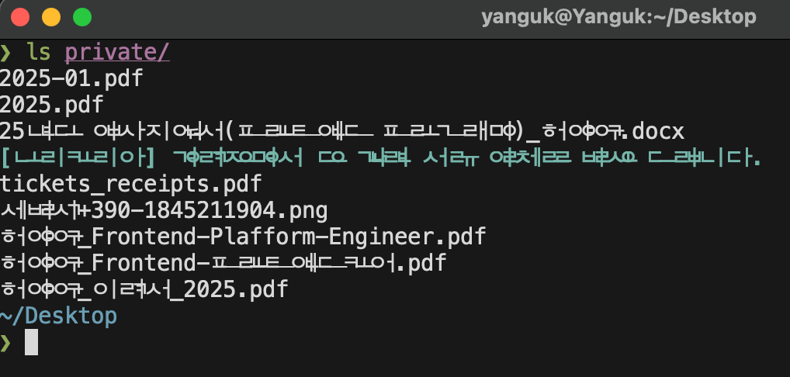

# Alacritty, Ghossty 터미널

최근에 [ghossty](https://github.com/ghostty-org/ghostty) 라는 터미널을 알게 되었다.  
지금까지는 alacritty를 사용했었는데, alacritty의 단점들이 보완된
터미널이라서 ghossty로 갈아 타게 되었다.

두개의 터미널을 비교해본다.

| Feature                  | Alacritty | Ghossty        |
| ------------------------ | --------- | -------------- |
| GPU 가속 지원            | O         | O              |
| Unicode Normalization    | X         | O              |
| 이미지 프로토콜 지원     | X         | kitty protocol |
| 멀티 플렉스 창 분할 지원 | X         | O              |
| Native GUI               | X         | O              |

> Alacritty에서 느꼈던 단점들이 Ghossty에서는 상쇄됨.

### 1. GUP 가속 지원

터미널에서 nvim를 사용하고, 많은 행위를하기에, 속도를 가장 우선시 한다.  
가장 빠른 터미널은 alacritty인데 ghostty도 OpenGL를 써서 GPU를 사용하기에 alacritty
만큼 빠르다.

### 2. Unicode Normalization

Alacritty에서는 unicode Normalization을 수행하지 않으며, 이 때문에 한글이
깨진다.

하지만 ghossty는 한글도 잘나온다.

### 3. 이미지 프로토콜 지원

[yazi](https://yazi-rs.github.io/) 또는 `nvim` 을 사용하여 파일들을 관리하는데,  
alacritty를 사용했을땐 이미지를 볼수 없어서 이미지를 확인하고 싶을때마다
vscode를 실행시키곤 하였다.  
ghostty는 인기있는 kitty 터미널에서 사용하는
kitty프로토콜이 구현되어있고, 터미널에서 이미지도 확인이 가능하다.  
아주 편리 👍

> alacritty에서 방법이 없는건 아니다. ueberzugpp를 사용하면 되긴하는데 추가
> 설정이 귀찮기도 하고, 잘 작동되기를 기대 하긴 어렵다.

### 4. 멀티 플렉스 창 분할 지원

alacritty는 창분할이 없어서 tmux가 강제 된다.  
tmux 좋긴 한데, tmux환경을 위한
설정이 들어가야하고, 터미널환경과 동일하게 작동한다고 보장할 수가 없다.

tmux + nvim에서 언더컬을 지원하기 위한 설정 이랑 커서 깜빡임 현상, yazi + tmux 사용시
한글 깨짐... 등등

ghostty는 기본적으로 창분할이 지원되서 그냥쓰면된다.  
tmux 관리하기는 이제 귀찮다. ghostty만세 👍

### 5. Nagive GUI

ghostty는 mac에서는 swift로 만들어진 GUI라서 깔끔하다.  
alacritty에서는 전체 화면했다가 돌아오면 버튼위치가 달라지는 버그가 있는데, ghostty는 그런버그도
없다.
